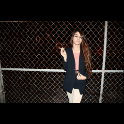
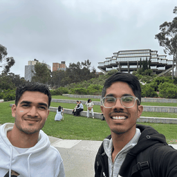

# Image Inpainting with RePaint and DDIM

This project implements image inpainting using diffusion models, offering both RePaint's DDPM sampling and accelerated DDIM sampling. We build upon the guided-diffusion framework and integrate SAM (Segment Anything Model) for interactive mask generation, creating a powerful and user-friendly inpainting solution.

## Performance Benchmarks (NVIDIA A40 GPU)

| Method | Steps | Time per Image | Quality |
|--------|-------|----------------|----------|
| DDPM   | 1000  | ~15 minutes    | Highest  |
| DDIM   | 20-50 | <20 seconds    | Excellent|

## Project Overview

Our implementation combines three key technologies:

1. **RePaint Implementation (DDPM)**:
   - Full 1000-step diffusion for highest quality results
   - Resampling strategy for complex inpainting
   - Ideal for challenging cases requiring maximum quality
   - Runtime: ~15 minutes per image on NVIDIA A40

2. **DDIM Fast Sampling**:
   - Accelerated sampling with as few as 20 steps
   - Excellent results in under 20 seconds on NVIDIA A40
   - Perfect for quick iterations and real-time applications

3. **Interactive Mask Generation**:
   - Integration with Meta's Segment Anything Model (SAM)
   - Point-and-click object selection
   - Multiple mask options with real-time preview
   - Adjustable mask refinement

### Key Features

1. **Flexible Sampling Strategy**:
   - DDPM (RePaint): 1000 steps, ~14 minutes, highest quality
   - DDIM: 20-50 steps, <20 seconds, excellent quality
   - User choice between speed and quality at runtime

2. **Advanced Mask Handling**:
   - SAM-powered interactive selection
   - Multiple mask options for best results
   - Mask dilation for better boundaries
   - Support for arbitrary shapes and sizes

3. **User-Friendly Interface**:
   - Simple command-line interface
   - Visual feedback for mask selection
   - Progress visualization with evolution GIFs
   - Easy switching between sampling methods

## Quick Start

1. **Setup**:
   ```bash
   # Clone the repository and switch to DDIM branch
   git clone [repository-url]
   cd [repository-name]
   git checkout ddim

   # Install dependencies
   pip install -r requirements.txt

   # Download required models
   # - SAM checkpoint (sam_vit_h_4b8939.pth) should be in models/
   # - Diffusion model (256x256_diffusion_uncond.pt) should be in models/
   ```

2. **Usage**:
   ```bash
   # Place your image in the data/ directory
   cp your_image.jpg data/

   # Run the magic eraser
   python src/magic_eraser.py
   ```

   The script will prompt you for:
   - Image selection
   - Number of sampling steps (T) - recommended range: 20-200
   - Number of iterations (U) - recommended range: 1-10

3. **Results**:
   Results will be saved in `results/inpainting_tests/[image_name]/`:
   - `mask.png`: The generated mask
   - `inpainted.png`: The final inpainted result
   - `evolution.gif`: Visualization of the inpainting process

## Parameter Guide

### DDIM Parameters

1. **Sampling Steps (T)**:
   - Range: 20-200 steps
   - Lower values (20-50): Faster but potentially lower quality
   - Higher values (100-200): Better quality but slower
   - Default recommendation: 50 steps for a good speed/quality balance

2. **Iterations (U)**:
   - Range: 1-10 iterations
   - Lower values (1-3): Faster, suitable for simple masks
   - Higher values (5-10): Better for complex masks
   - Default recommendation: U=5 for most cases

### Mask Generation

The SAM-based mask generation offers:
- Interactive point selection
- Multiple mask options
- Adjustable mask dilation
- Option to retry if not satisfied

## Comparison with DDPM Branch

This DDIM branch differs from the main (DDPM) branch in several ways:

| Feature           | DDIM Branch (This)     | DDPM Branch (Main)     |
|------------------|------------------------|----------------------|
| Sampling Steps   | 20-200 (configurable) | Fixed 1000 steps    |
| Speed            | 5-50x faster          | Standard speed      |
| Deterministic    | Yes                   | No                  |
| Memory Usage     | Lower                 | Higher              |
| Quality         | Good                  | Slightly better     |

## Advanced Usage

For advanced users who want to experiment with different parameters:

1. **Batch Testing**:
   ```bash
   python src/run_ddim_test.py
   ```
   - Test multiple T values (20, 50, 100, 200)
   - Compare results across different parameters
   - Automated processing of multiple images

## Results

### Summary Animation


This animation shows a sequence of our inpainting results. For each example:
1. Original image
2. Region to be inpainted (highlighted in red)
3. Final inpainted result

### Detailed Comparisons

#### DDPM vs DDIM Comparison

*DDPM results with different U values (1000 timesteps)*


*DDIM results with different T values (much fewer timesteps)*

#### Process Visualization


This GIF shows the complete inpainting process:
1. Original image
2. Mask overlay showing the region to be inpainted
3. Evolution of the inpainting process from noise to final result

### Key Findings
- DDIM achieves comparable or better results in just 20 iterations (~20 seconds)
- DDPM requires 1000 iterations (>15 minutes) for similar results
- Successfully adapted RePaint's algorithm to work with DDIM sampling
- Interactive applications become feasible with DDIM's speed

## Acknowledgments

This project builds upon several key works:
- [Guided Diffusion](https://github.com/openai/guided-diffusion)
- [DDIM Paper](https://arxiv.org/abs/2010.02502)
- [RePaint Paper](https://arxiv.org/abs/2201.09865)
- [Segment Anything Model](https://segment-anything.com/)